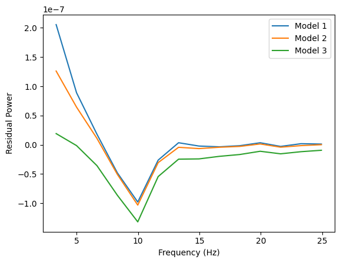

🧠  **EEG Signal Analysis – ERP vs Aperiodic Brain Activity**

**Goals**
+ Replicate key findings from a published EEG study and then replicate with a different ERP.
+ Demonstrate that ERPs and 1/f dynamics reflect distinct neural processes.
+ Visualize how ERPs and broadband background shifts evolve post-stimulus. 
  
**Results**
+ Confirmed that stimulus-induced changes in 1/f activity are separable from ERPs.  
+ Demonstrated that ERPs alone do not account for all post-stimulus spectral changes.
+ Observed consistent steepening of the aperiodic exponent following stimulus presentation.
  
**Methodology**
+ EEG recordings (n = 40) were preprocessed and segmented into pre- and post-stimulus time windows.
+ Applied Fourier Transform to compute power spectra across electrodes and time bins.
+ Used spectral fitting (FOOOF) to extract aperiodic parameters (offset, exponent).
+ Computed ERPs and visually separated their contribution from aperiodic shifts.

**Skills/ Tools**
+ ****Language****: Python
+ ****Libraries****: MNE, NumPy, Pandas, Matplotlib, Seaborn, FOOOF
+ ****Techniques****: Fast Fourier Transform (FFT), permutation testing, generating power spectra
+ ****Skills Demonstrated****: Signal processing, hypothesis testing, EEG power spectral analysis, data visualization

**Visuals**

 
**How to run**
+ Clone repo
+ install nescessary libraries
+ run df creation
+ run post_minus_erp_permutation
+ run permutation_analysis
+ run model_creation_full_script
  
